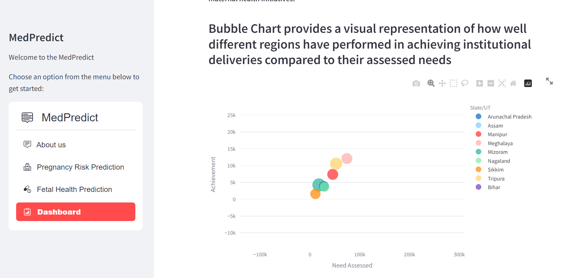

# MatCare - Advanced Maternal and Fetal Health Prediction Platform

## Introduction

Welcome to MatCare, an innovative platform dedicated to advancing maternal and fetal health through predictive analysis. MatCare empowers healthcare professionals and users alike by providing accurate predictions and proactive risk management related to pregnancy.

### Webapp URL
MatCare: [MatCare link](https://maternalcare-cbupxflodo4uhz8hzqqqng.streamlit.app/)

## Key Features

- **Pregnancy Risk Prediction:** This feature employs advanced algorithms to analyze vital maternal health parameters such as age, blood sugar levels, blood pressure, and other clinical indicators. By identifying potential risks like gestational diabetes, hypertensive disorders, or preeclampsia, your system aids in early intervention and better pregnancy management.

- **Fetal Health Prediction:** Using Cardiotocograms (CTGs), your platform monitors fetal heart rate and uterine contractions, which are crucial indicators of fetal well-being. The integration of AI in analyzing CTG data ensures accurate classification of fetal health conditions, reducing subjectivity and enabling timely decision-making.

- **Dashboard:** The dashboard offers a consolidated view of predictive analyses and health metrics. It ensures accessibility for both healthcare providers and patients, promoting informed decision-making and continuous monitoring.

###

     

     

###
